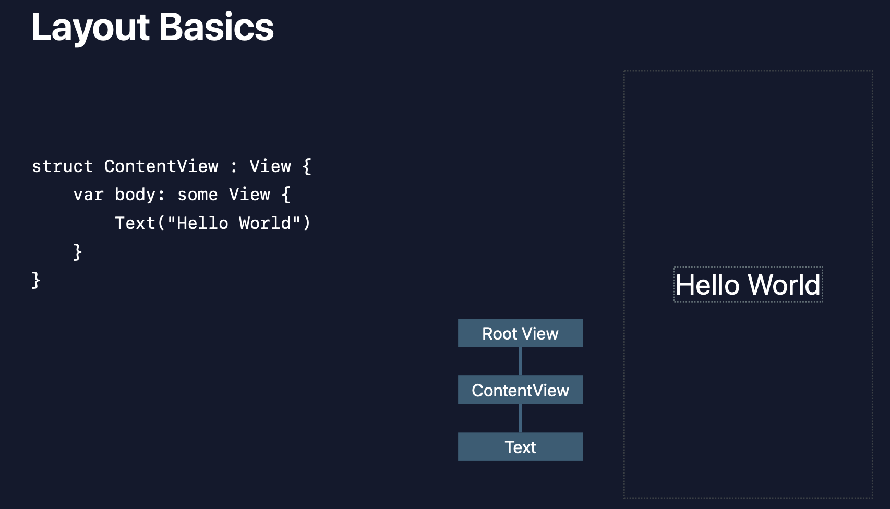
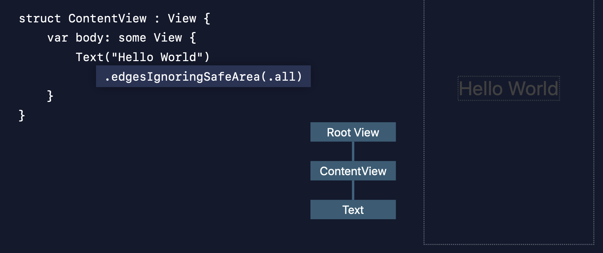

# Building Custom Views with SwiftUI

- [Video](https://developer.apple.com/videos/play/wwdc2019/237/)

## Layout Basics

Let's start by taking a lot at this simple view. There are actually three views at work here:

- There's the `Text` at the bottom of the view hierarchy
- Your `ContentView` which always has the same bounds as the body of the text.
- And finally the `RootView` which in this case has the dimensions of the device minus the safe area insets.

You can still layout stuff in the safe area using this modifier:

But by default you are in the safe zone.