# Discoverable Design

[WWDC Video](https://developer.apple.com/videos/play/wwdc2021/10126/)

## Challenge

Our new toasty app does several new things:

- Choose recipes
- See toasts made by friends
- Take a picture of toast

Challenge is how will people learn about these new features?

We could create some onboarding...

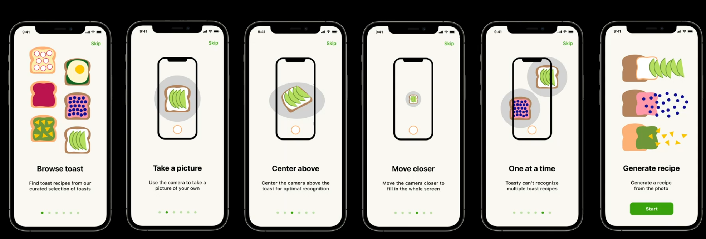

Except people often skip onboarding altogether.

Instead let's see if we can create an interface that:

- stands on its own
- doesn't require onboarding/tutorials

And instead lets them

> Learn by doing

## Five things to make your app more discoverable

1. Priortize important features

2. Provide visual clues

 - use words and symbols people are familiar with to provide clues

3. Hint with gestures

 - use gestures for fluid navigation but hints as gestures

4. Organize by behavior

5. Convey a sense of control over content

## Prioritizing the features

Here is all the prioritzed feature list for our app:

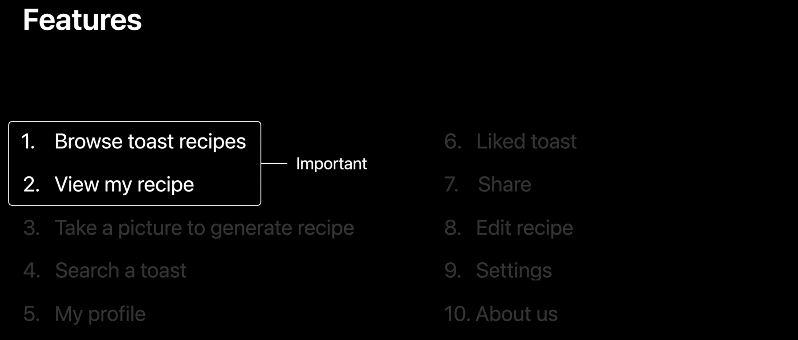

### Avoid hamburger menus

One tempting thing to do would be to throw all non-essential features into a hamburger menu. But what's much better is a tab bar:

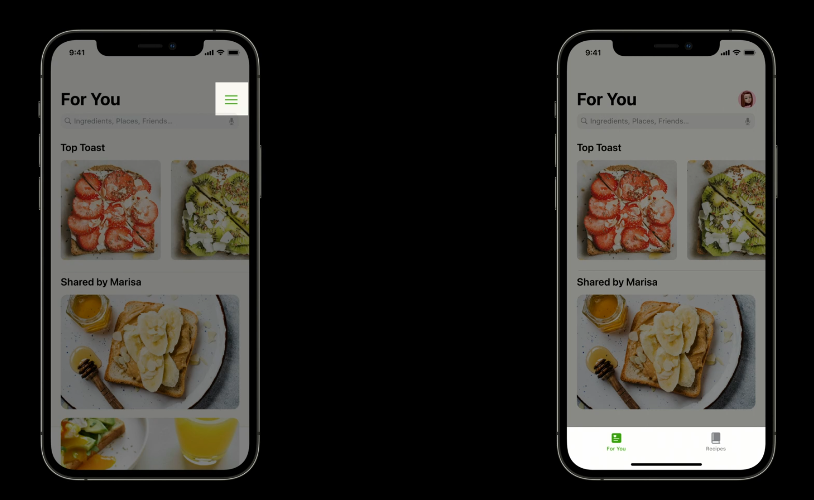

With hamburger menus its not clear what features are in the menu, and it requires too much work on behalf of the user to figure out.

Instead go with the tab bar.

## Break your app up

Instead of treating all your features as the same:

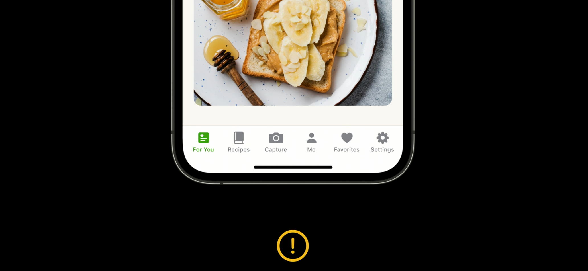

See if you can break your app up. Here are the two most important things our app does, each getting its own tab:

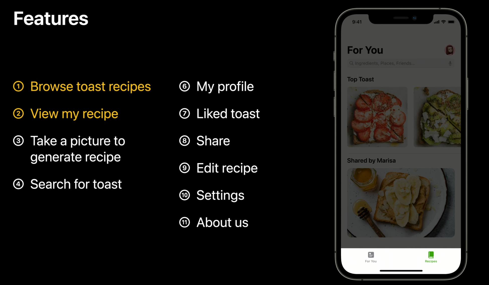

Take a picture we can work in on the recipes page like this:

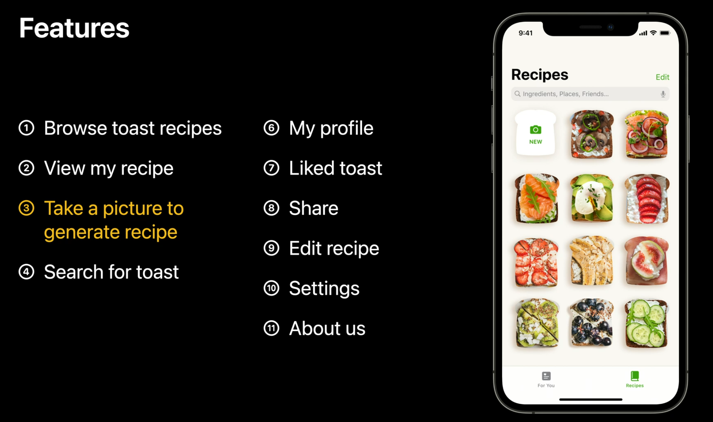

And search is handled at the top like so:

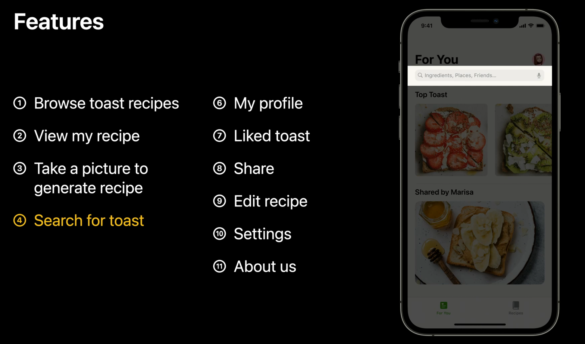

He rest, which we don't handle so often can come from our profile page:

## Provide visual queues

### Provide labels with icons

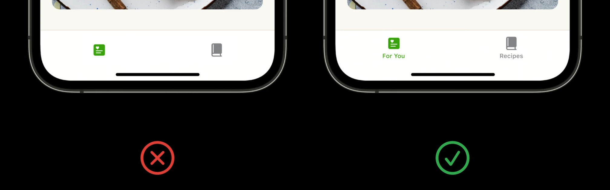

Same with the camera icon here:

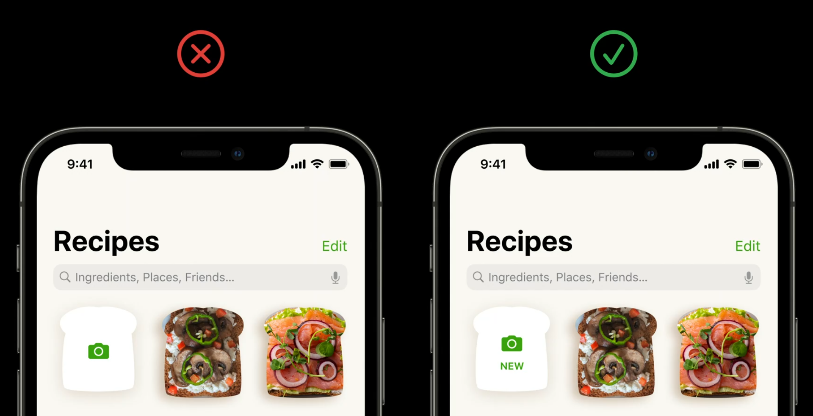

Provide suggestions for search:

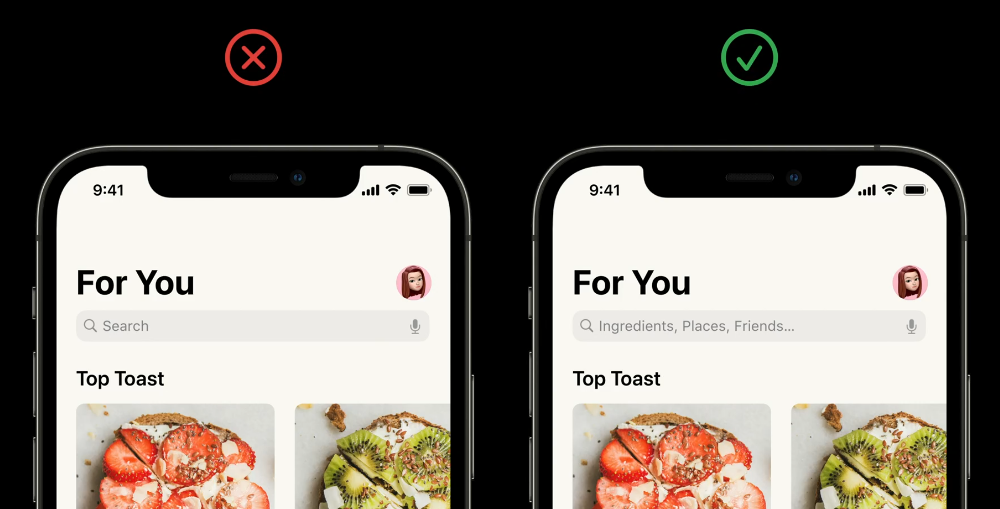

### Use animation to teach in context

Here we can use an animation to guide people to take a picture of their toast:

Before we have toast in view, the shutter button is deactivated and we let them know we are scanning for toast:

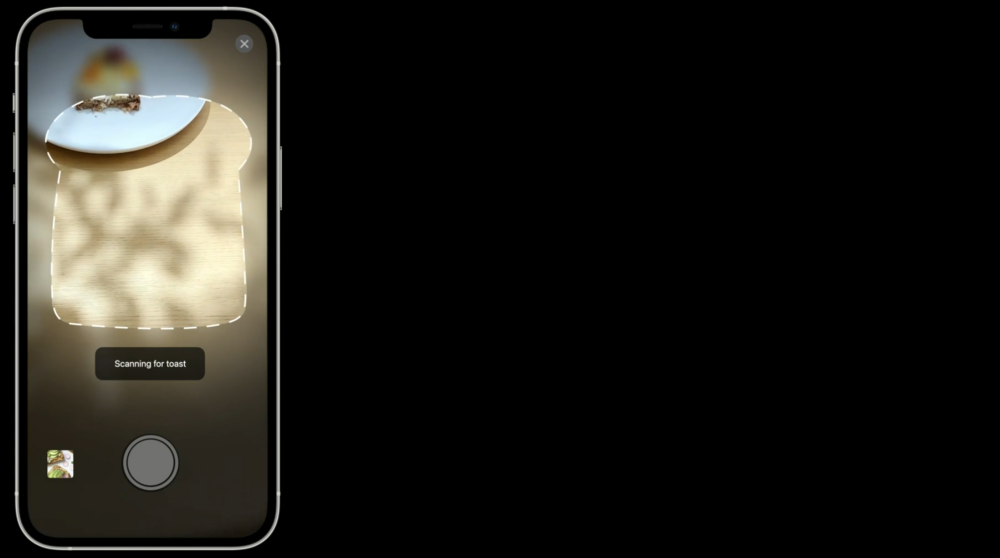

When the camera is at the right angle, we enable the shutter button and ask them to center and then provide haptic feedback letting them know they are OK to take the picture:

## Hint at gestures

Great as invisible shortcuts to navigation. Use defaults. Then mimic real life interactions.

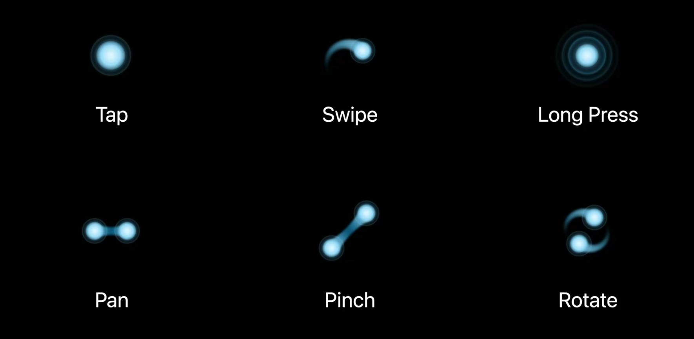

Could use pinch to show more recipes:

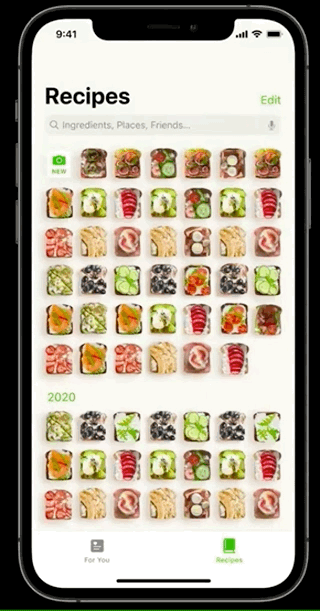

Some people familiar with social apps might expect double tap to like. Here we include the icon as well for those who may not be familiar:

> Use gestures as a shortcut. Not a replacement.

Do this because no matter how intuitive a gesture might be, it is still invisible. Hense, people may not see it. Still have a primary way to perform the gesture that is still magical.

### Use animation to hint at gestures

Use can use animations to give hints that a gesture is there. For example here are two ways we could minimize the detail photo.

We could pull down as a swipe to dismiss (similar to the photos app). Or we could use the standard back button chevron most people are familiar with.

> People should now what to do next without having to touch the screen.

## Organize by behavior

Here you group things by how you the think the user will want to interact.

For example customers may want to discover receipices by:

- restaurant
- friends
- tasty picks (recommendation engine)

To organize things better, break up your UI to refeclt these behaviors:

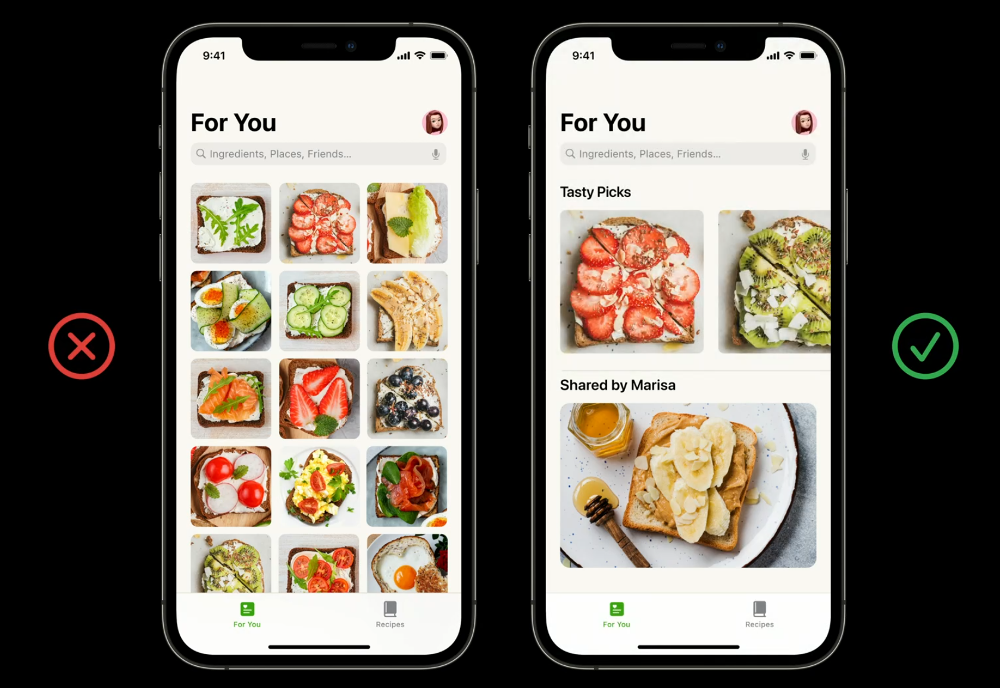

## Convey a sense of control over content

### Let people provide explicit feedback

Because a heart, thumbs up/down, doesn't convey enough context, add some text to make things clear:

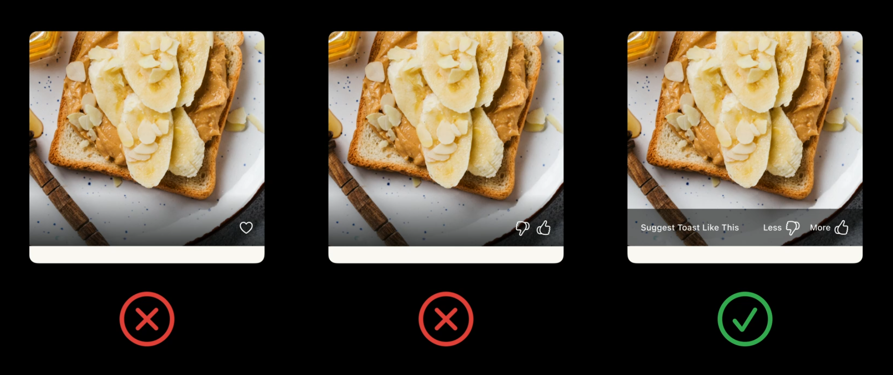

### Disclose implicit feedback

This is information that arises as people interact with your apps features.

For example as our recommendation engine makes suggestions, Tasty picks is going to get more populated.

To make it clear how these selections got there, add a short description under the title:

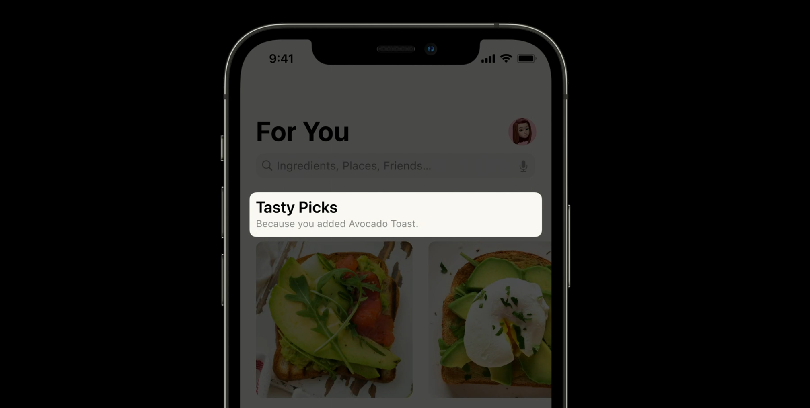

### Give control over recommendations

If people aren't happy with the recommendations we are giving, let them control the results.

Here we can do this with a more options button:

Not bad. But what would be even better is a text button describing what the option does:

After tapping on that button different suggestions can then be made:

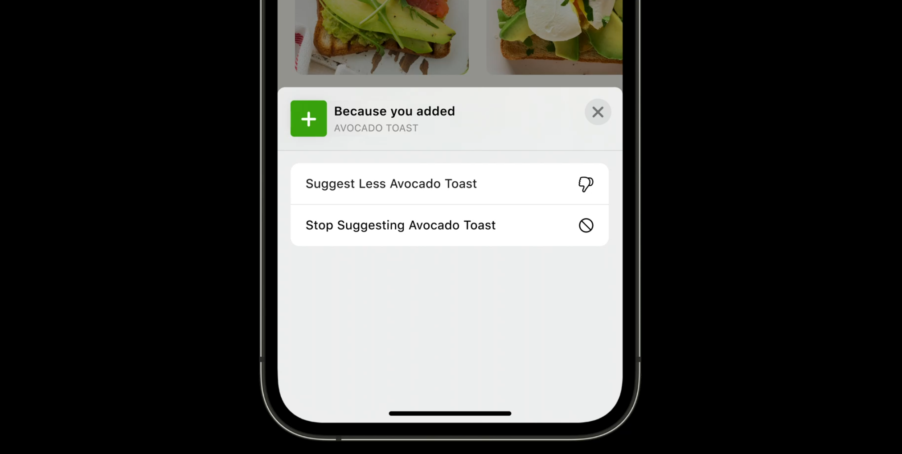

