# Compose custom layouts with SwiftUI

- [Video](https://developer.apple.com/videos/play/wwdc2022/10056/)

## Grid

`LazyHGrid` are great for scrollable content. They only render that which is visible. And are good for when you have many elements off screen.

On the other hand that means the container can't automatically size itself as it doesn't know how big it really is in both dimensions.

LazyHGrid can figure out how wide to make each column because it can measure all views in the column before drawing them. Because they are all onscreen.

But it can't measure every view in a row to figure out the rows height, because most are off screen and it has no idea how high they are. To make `LazyGrid` work you need to provide one of these dimensions at initialization time.

But for those instances where you don't need scrolling, and you'd like to let SwiftUI figure out the width and the height for each cell, use `Grid`.

Unlike the `LazyGrid` the `Grid` loads all of its views at once. This let's it automatically figure out its height and width across its columns and its rows.

`Grid` allocates as much space as required to accomodate its largest view:

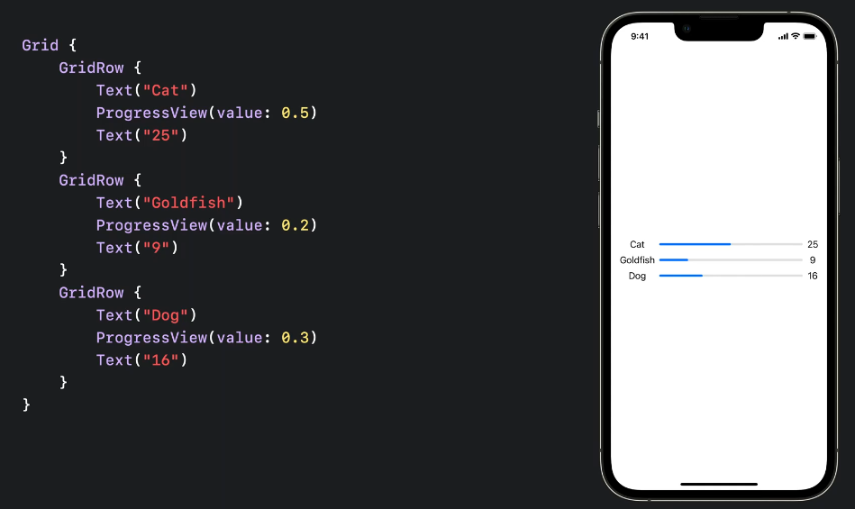

So the first text colum is wide enough for the longest name, but no wider.

### Data model

To set up the data model lets create a `stuct` that is `Identifiable` so that it will work nicely in a `ForEach`:

And `Equatable` to make it possible to animate changes.

Here is how we can setup and user our example data:

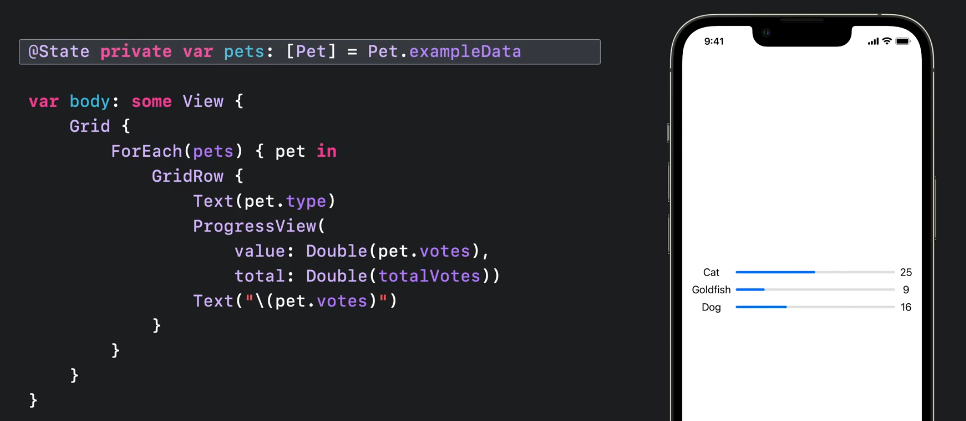

Not bad, but let's fix the cell alignment. Currently all the cells are `center` aligned, which is the default for a grid.

To `lead` align the `Grid`, but `trail` align the last text element we can do this:

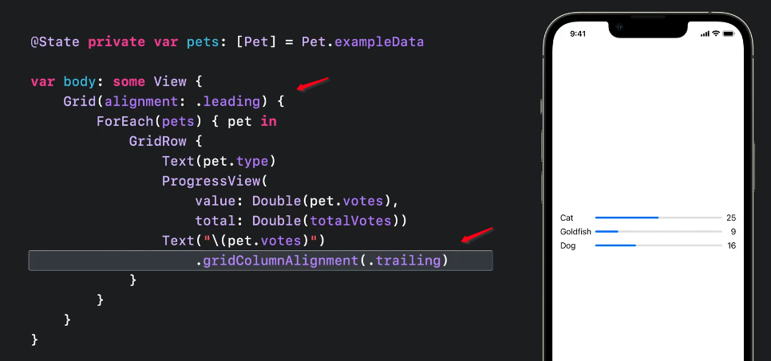

### Divider

One way to add a divider between each row would be like this:

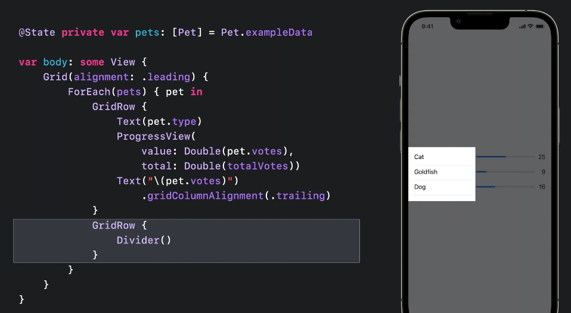

But notice this does a couple of things. First, because the `Divider` is a flexible view, it causes the first column to now take more space.

What's happening here is the grid is giving the last column the space it needs, and then dividing the remaining space between the two other columns.

Second, for a grid view that doesn't have as many cells as the other rows, the missing view create empty cells for the missing columns.

But what we really want is to have all the columns span the entire grid. And SwiftUI has a new view modifer that let's us do that.

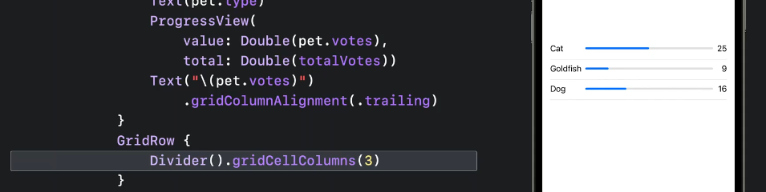

Or we could simplify to as follows:

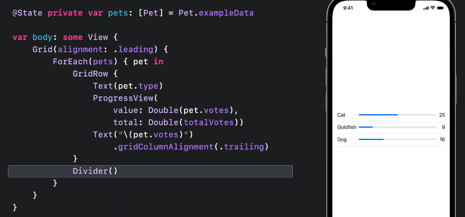

### Buttons

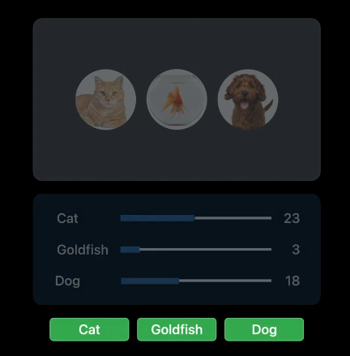

The goal here is to make the buttons equal to the widest button text.

If we try this with an `HStack` the buttons draw themselves relatively sized to the text they contain. Which isn't what we want.

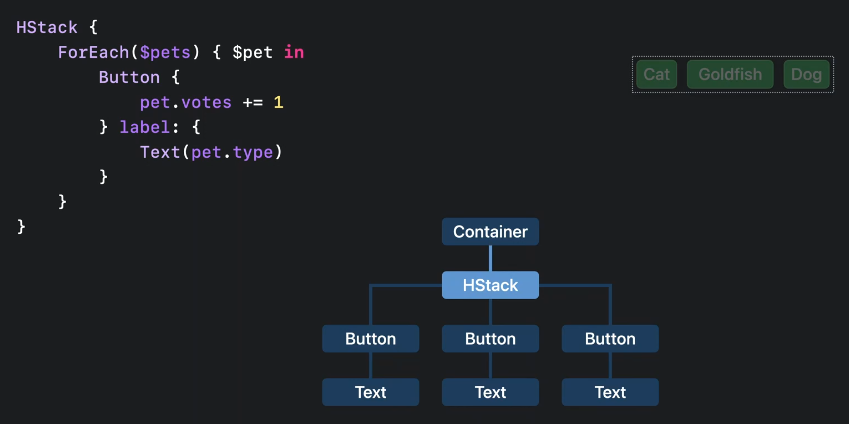

We could embed this all in a `frame` and make it a flexible subview, but this would take all the space avaiable. The `HStack` distributes its space equally to all its subviews. The stack will expand to take whatever space the container offers. Which isn't what we want.

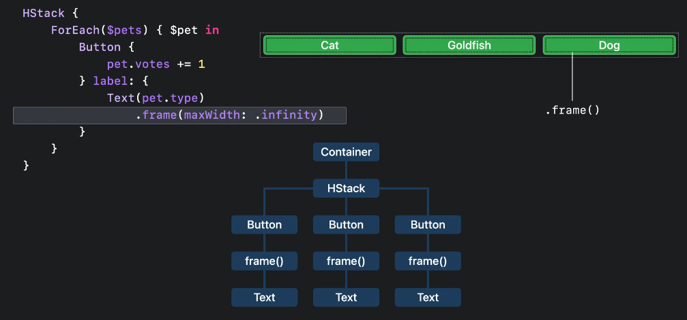

But what we really want is a custom stack type:

- that asks for the ideal size of each button
- finds the widest
- and then offers that amount to each one

We can do that using the `Layout` protocol.

## Layout

Lets start by defining our own `HStack` representing what we want:

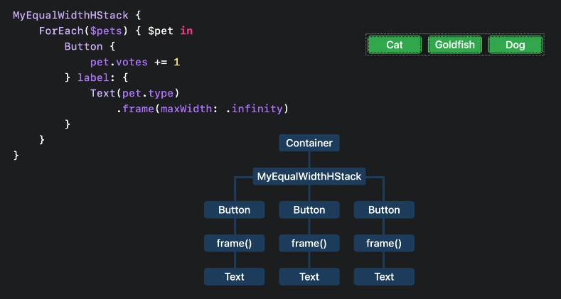

This struct is going to allocate width to the buttons equally, as wide as the ideal width.

We will keep the flexible `frame` so narrow buttons can still expand, but the buttons will still have an ideal size we can measure which is the width of their text.

To do this, define a type that conforms to the `Layout` protocol:

- `sizeThatFits`

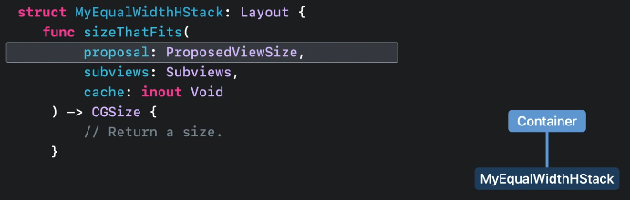

We have a `ProposedViewSize` which comes from the container view, and we can interact with the `SubView` through there proxies (we can't interact directly with the subviews themselves):

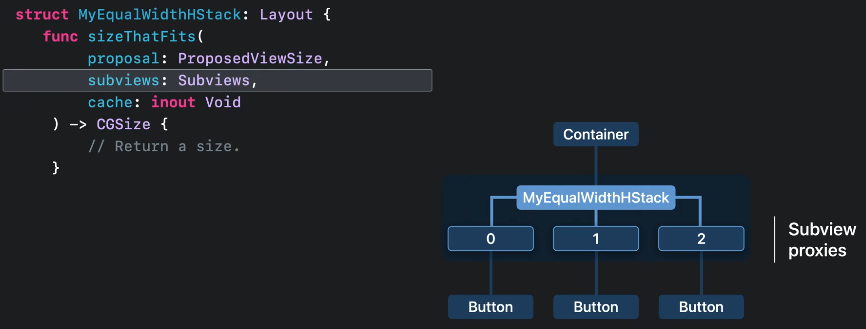 

Each proxy returns a concrete size based on the proposal I've made. We'll collect all those responses and use them to do some calculations and then return a concrete size for this struct, that fits it's container.

- `placeSubViews`

In this method we tell our layout subviews where to appear. Same inputs, along with a `bounds` region. This is the region we calculated in our `sizeThatFits` and it represents the region we need to place our subviews into.

Remember views pick their own size in SwiftUI, so my layout container will get the size that it asks for:

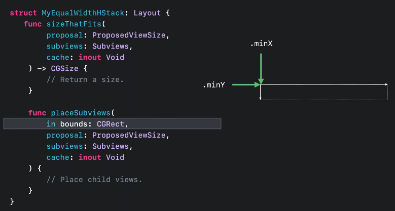 

`cache` is something you can use as an `inout` parameter to share calculations among other layouts. You will most likely never need this, and only use if you need to improve your layout performance.

OK, so to get our equal width buttons we can calculate `sizeTheFits` as follows.

First we ask each button for its size. `.unspecified` means idea size:

Then we can find the largest value in each dimension from the sizes that we get back:

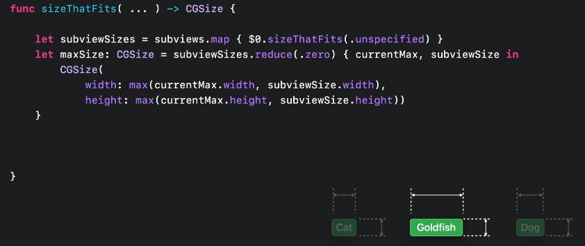

Next we need to account for the spacing between views. We could just use a constant like `10pts`, but the `Layout` protocol lets us do better.

In SwiftUI, all views have spacing preferences that indicate the amount of space the view prefers between itself and the next view.

These preferences are stored in a view spacing instance that is available to layout containers.

The view might prefer different values on different edges, and even different values for different kinds of adjacent views.

You can ignore these preferences, but respecting them is a good way to get results that follow Apples interface guidelines.

In the event you get two views with different preferences, SwiftUI takes the larger of the two.

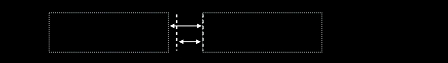

The subview proxies give me a way to ask for each button's preferred spacing along a given axis.

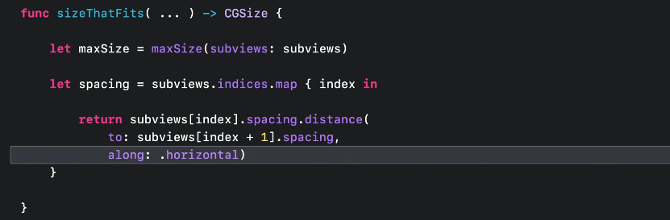

Now we can combine all that to help us calculate our size value:

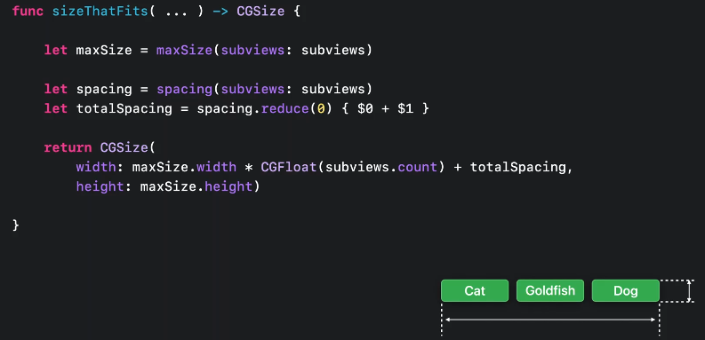

Then we do the same thing for `placeSubViews`:

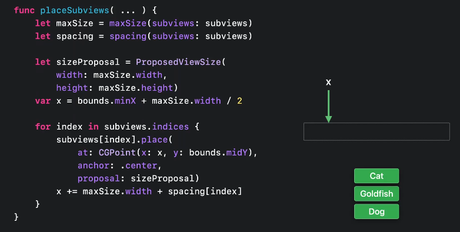

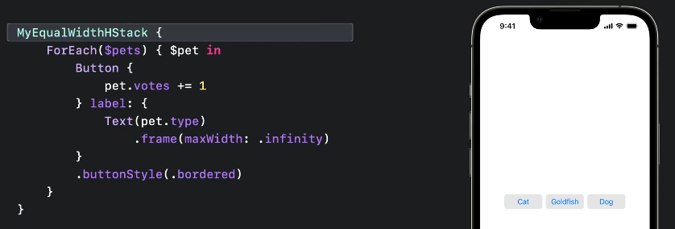

### Why not user Geometry reader

`GeometryReader` tells its subviews how much space they have to work with based on their container. This information flows downwards:

`Geometry` reader is great for drawing paths that need to adapt to the space their container offers:

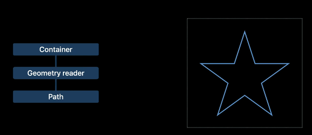

