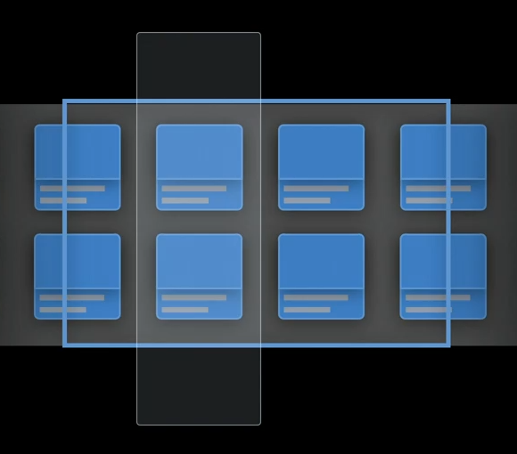
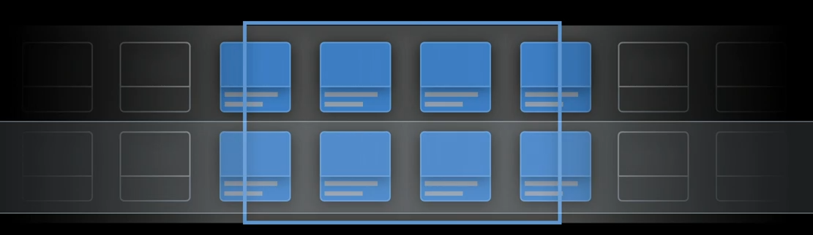

# Compose custom layouts with SwiftUI

- [Video](https://developer.apple.com/videos/play/wwdc2022/10056/)

## Grid

`LazyHGrid` are great for scrollable content. They only render that which is visible. And are good for when you have many elements off screen.

On the other hand that means the container can't automatically size itself as it doesn't know how big it really is in both dimensions.

LazyHGrid can figure out how wide to make each column because it can measure all views in the column before drawing them. Because they are all onscreen.

But it can't measure every view in a row to figure out the rows height, because most are off screen and it has no idea how high they are. To make `LazyGrid` work you need to provide one of these dimensions at initialization time.

