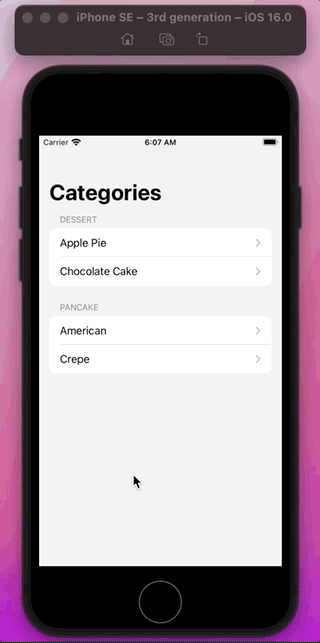

# Swift UI Cookbook for navigation

Old `NavigationLink` you needed an property on each item to decide whether to show:


With new `NavigationStack` that property is lifted up to the top and captured in the form of a path:


- Navigation values append values to the path.
- Can deeplink by mutating the path.
- Or pop to the root view by removing all items from the path.


Old way (and still valid) was to set view in closure. New way is to pass `value`:


- `NavigationLink` is smart. It's behavior depends on the `NavigationStack` or `List` it's link appears in.

Here is the old (current) way to setup a `NavigationLink`:


But what about programmatic navigation?

## Programmatic navigation

Need to tease apart two parts of navigation link:

- the value
- the view

First we pull the view we want to navigate to out of the link closure and into a `navigationDestination` modifier:


 
This modifier declares the type of the data it's view is responsible for:

 

The modifer takes a `ViewBuilder` which describes the view that gets pushed onto the stack when a `Recipe` value is presented.


Then we just present the `recipe` value using the new `NavigationLink` constructor like this:


## How does it work?

Every navigation stack keeps track of a path that represents all the data that the stack is showing. Here is the root view when the path is empty:


Next, the navigation stack also keeps track of all the navigation destinations declared inside it, or pushed onto it. It is a set but in this example we only push one view:


When you tap a value to a link, it appends that value to the path:


Then the path maps its values over the destination views to decide what view to push onto the stack:


Now, if we drill deeper, the new view gets appended to the path:

 

Navigation stack does it's magic, and pushes another detailed view onto the stack:


And when you click back, views simply get popped off the view.

## Path and binding

Navigation stack has one more trick. The `path` and connect itself to a binding.

To bind the path, first we'll add some state:


If you need to present multiple types onto a path, check out the new type erasing `NavigationPath` for mixed data:


Once you've got your path state, you can pass it as a binding to the stack:


With that in place you can now do all sorts of things. For example you could add a method to show a specific recipe:


Or pop back to the root, simply by resetting the path:


And that is an example of how to create a pushable stack:


### Links that help

- [Video](https://developer.apple.com/videos/play/wwdc2022/10054/)


## Source

### Data

**recipeData.json**

```swift
{
    "id": 1,
    "name": "Apple Pie",
    "category": "Dessert",
    "ingredients": [
        "3/4 cup white suguar",
        "2 tablespoons all-purpose flour"
    ],
    "relatedRecipes": [
        "Baklava"
    ]
}
```

**recipesData.json**

```swift
[
    {
        "id": 1,
        "name": "Apple Pie",
        "category": "Dessert",
        "ingredients": [
            "3/4 cup white suguar",
            "2 tablespoons all-purpose flour"
        ],
        "relatedRecipes": [
            "Baklava"
        ]
    },
    {
        "id": 2,
        "name": "Chocolate Cake",
        "category": "Dessert",
        "ingredients": [
            "3/4 cup white suguar",
            "2 tablespoons all-purpose flour"
        ],
        "relatedRecipes": [
            "Baklava"
        ]
    },
    {
        "id": 3,
        "name": "American",
        "category": "Pancake",
        "ingredients": [
            "3/4 cup white suguar",
            "2 tablespoons all-purpose flour"
        ],
        "relatedRecipes": [
            "Baklava"
        ]
    },
    {
        "id": 4,
        "name": "Crepe",
        "category": "Pancake",
        "ingredients": [
            "3/4 cup white suguar",
            "2 tablespoons all-purpose flour"
        ],
        "relatedRecipes": [
            "Baklava"
        ]
    }
]
```

**ModelData**

```swift
import Foundation

struct Recipe: Hashable, Codable, Identifiable {
    let id: Int
    let name: String
    let category: String
    let ingredients: [String]
    let relatedRecipes: [String]
}

enum Category: CaseIterable, Identifiable {
    case dessert, pancake

    var id: Self { self }
    var localizedName: String {
        switch self {
        case .dessert:
            return "Dessert"
        case .pancake:
            return "Pancake"
        }
    }
}

final class ModelData: ObservableObject {
    var recipe: Recipe = load("recipeData.json")
    var recipes: [Recipe] = load("recipesData.json")

    func myRecipes(in category: Category) -> [Recipe] {
        recipes.filter { $0.category == category.localizedName }
    }
}

func load<T: Decodable>(_ filename: String) -> T {
    let data: Data

    guard let file = Bundle.main.url(forResource: filename, withExtension: nil)
    else {
        fatalError("Couldn't find \(filename) in main bundle.")
    }

    do {
        data = try Data(contentsOf: file)
    } catch {
        fatalError("Couldn't load \(filename) from main bundle:\n\(error)")
    }

    do {
        let decoder = JSONDecoder()
        return try decoder.decode(T.self, from: data)
    } catch {
        fatalError("Couldn't parse \(filename) as \(T.self):\n\(error)")
    }
}
```

**App**

```swift
@main
struct RecipeApp: App {
    @StateObject private var modelData = ModelData()

    var body: some Scene {
        WindowGroup {
            ContentView()
                .environmentObject(modelData)
        }
    }
}
```

**ContentView**

```swift
import SwiftUI

struct ContentView: View {
    @EnvironmentObject var modelData: ModelData
    
    var body: some View {
        NavigationStack {
            List(Category.allCases) { category in
                Section(category.localizedName) {
                    ForEach(modelData.myRecipes(in: category)) { recipe in
                        NavigationLink(recipe.name, value: recipe)
                    }
                }
            }
            .navigationTitle("Categories")
            .navigationDestination(for: Recipe.self) { recipe in
                RecipeDetail(recipe: recipe)
            }
        }
    }
}

struct ContentView_Previews: PreviewProvider {
    static var previews: some View {
        ContentView()
            .environmentObject(ModelData())
    }
}
```

### Enum Identifiable

```swift
enum Category: CaseIterable, Identifiable {
    case dessert, pancake

    var id: Self { self } // 
    var localizedName: String {
        switch self {
        case .dessert:
            return "Dessert"
        case .pancake:
            return "Pancake"
        }
    }
}
```



