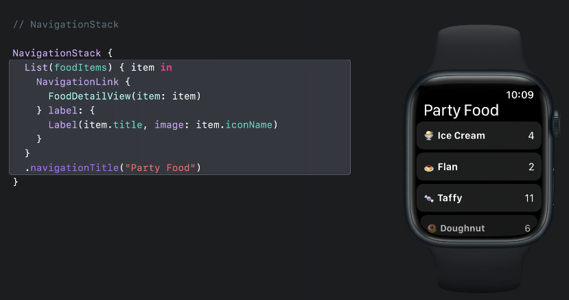
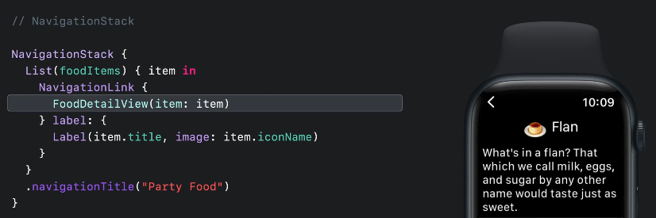
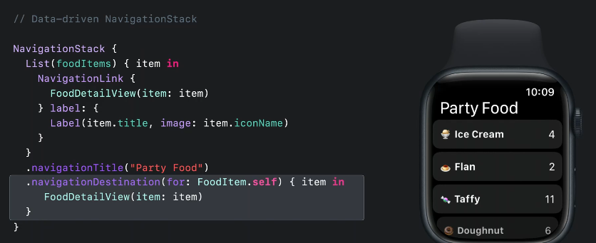
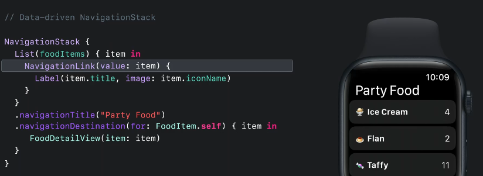
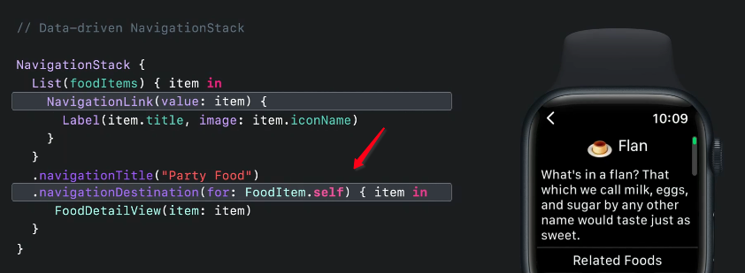
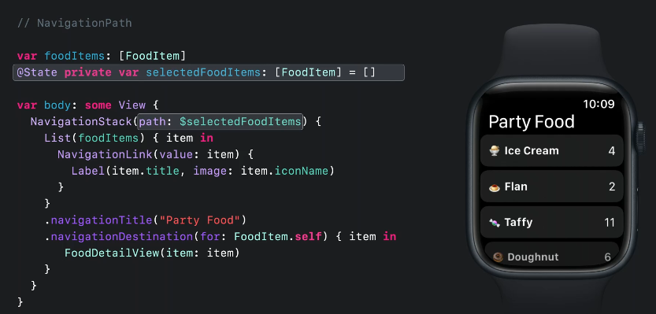
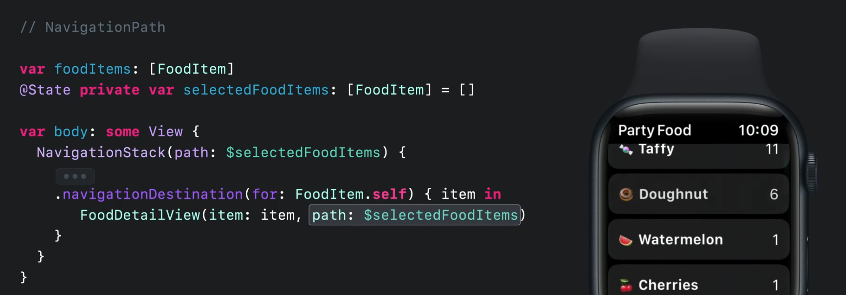

# What's New in SwiftUI 2022

- [Video](https://developer.apple.com/videos/play/wwdc2022/10052)

## NavigationStack

`NavigationStack` is a new container that supports push and pop style navigation. It wraps a root content view:

It works great with existing APIs like `NavigationLink` and view modifiers like `.navigationTitle`.

When we select a link, it pushes its detailed view on top of the stack:

This might be all you need, but there is a new way to present views and have programmatic control over that state.

### New data drive APIs

The new `navigationDestination` view modifier lets us associate navigation destinations with specific data types:

And this year we taught `NavigationLink` how to take a `value`, instead of a destination view, that represents a navigation destination:

When tapping on a link, SwiftUI will use its `value` type to find the right destination and push it on the stack:

### Path as explicit state

Because we are using data to drive our stack, its possible to represent our current navigation stack as explicit state.

In this example, we can represent the navigation path as all the view items we have visited:

With direct access to this, we could now add a button that programmatically jumps back to the first item by simply removing the other items in the path state.

As views are pushed onto the stack, items are pushed onto the `selectedFoodItems` array:

In the buttons action, we can just remove

